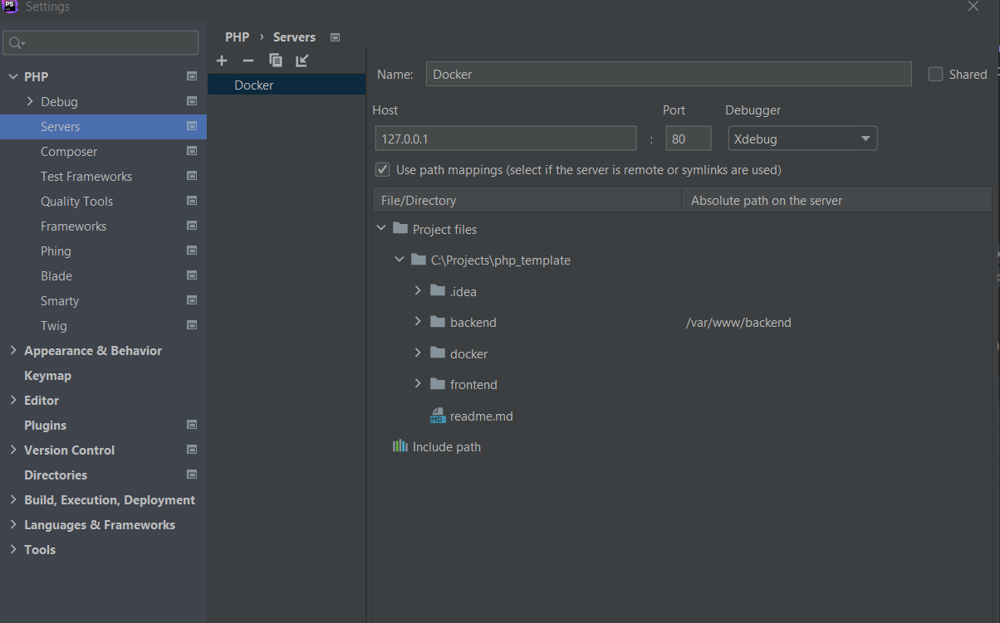

# PHP 8.0 Template

## What is this

Let's consider that you don't want to install PHP and stuff 
around (like database, nginx, and so on) on your local 
machine. You just want to be able to start and debug  
new one web application as soon as possible. 
Then this boilerplate is for you. It allows you to run
php 8, composer, nginx (that is configured for working with a 
separate frontend and backend on the same domain) and xDebug 3.
It also includes postgres.

## How to get started
- Clone the repo
- Navigate to the `docker` directory
- Run in your terminal `$ docker-compose up`
- Open your browser and type `lcoalhost`, you will see
a start application. 
  
## How to configure PhpStorm
- Open Settings
- Find `Server`
- Configure path mappings according to the screen below

  
